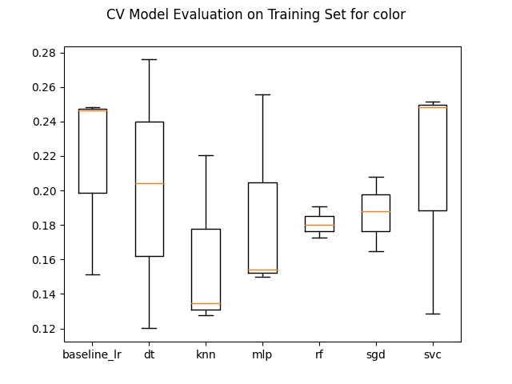
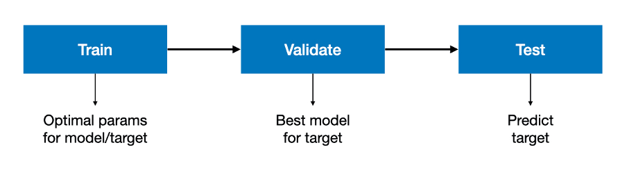

# Learning Visual Attributes

The aim was to design, implement and evaluate the optimal model to predict texture and colour of objects in images based on visual attributes. Training and test set were provided by [Kasim Terzic](https://kt54.host.cs.st-andrews.ac.uk/) and [Lei Fang](https://sites.google.com/view/leifangresearch/).



The dataset was based on a subset of the [GQA dataset](https://openaccess.thecvf.com/content_CVPR_2019/papers/Hudson_GQA_A_New_Dataset_for_Real-World_Visual_Reasoning_and_Compositional_CVPR_2019_paper.pdf) for learning attributes and relations. The GQA dataset consists of images where objects are annotated in terms of bounding boxes and relevant attributes and relations. Attributes extracted from bounding boxes included colour histograms (CIELAB), [histograms of oriented gradients](https://ieeexplore.ieee.org/abstract/document/1467360) (HOG) as well as a set of complex cell responses based on oriented Gabor filters generated by the [BIMP model](https://www.sciencedirect.com/science/article/abs/pii/S0925231214012624).


The decision was made not to train a model for multi-output classification but to aim for two multiclass classifiers, each optimised for the classification of one respective target, color or texture. An experimental approach was chosen that revolved around the use of a partly customised pipeline to which parameters were passed to be included in extensive grid searches per classifier and target.



Self-contained scripts were defined per classifier, baseline_lr.py, dt.py, etc. Within these scripts hyper-parameter tuning was performed using grid search to find the specific classifier's optimal parameters for each target. The parameters can be found in multi-line comments at the end of the self-contained scripts.

The optimal parameters for the combination of classifier and target, a dictionary, were saved to disk using pickle and be found in the ```optimal-params``` directory. After the optimal parameters had been found, all classifier-target combinations were evaluated using cross validation on the training set, performed in [eval_train_col.py](eval_train_col.py) and [eval_train_tex.py](eval_train_tex.py).

Finally, classifier-target combinations were evaluated on the validation set, performed in [eval_valid_col.py](eval_valid_col.py) and [eval_valid_tex.py](eval_valid_tex.py).

The following classification algorithms were implemented using [sklearn](https://scikit-learn.org/):
- Logistic regression (baseline)
- Decision tree
- K-nearest neighbours
- Multi-player perceptron
- Random forest
- Stochastic gradient descent
- Support vector

Based on the validation set evaluation, the following models and parameters were selected:

Model selected for color:
- Random forest classifier
- Validation set balanced accuracy: 0.183

Model selected for texture:
- Support vector classifier
- Validation set balanced accuracy: 0.254

The predicted output files [colour_test.csv](output/colour_test.csv) and [texture_test.csv](texture_test.csv) for the two classification tasks can be found in the ```output``` directory.

### Compiling and Running Instructions

Navigate into the ```visual``` directory:
```shell script
cd visual
```

Set up a virtual environment within the directory:
```shell script
python3 -m venv my_env
```

Activate the virtual environment:
```shell script
source my_env/bin/activate
```

Install the [requirements](requirements.txt) to your virtual environment via pip:
```shell script
pip install -r requirements.txt
```

To run a script, your command should take the following form:
```shell script
python3 <file_name>
```
